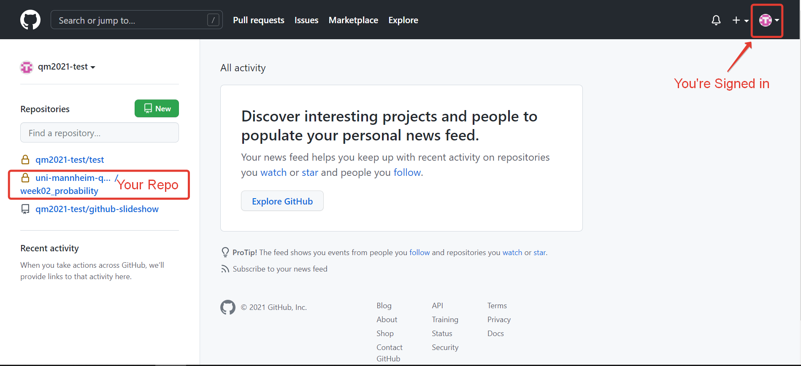
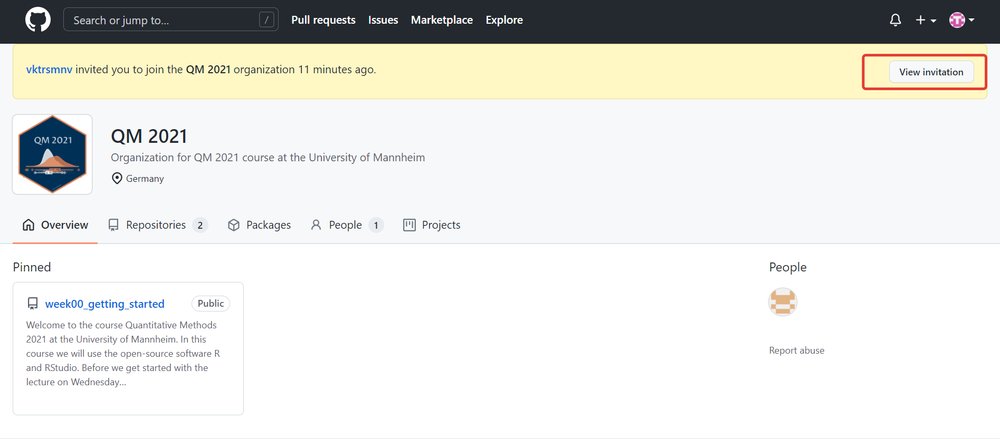

---
authors:
- admin
date: "2021-09-13"
projects: []
subtitle: ''
title: 'Locate Repo on Github'
summary: ""  
toc: true
menu:
  misc:
    weight: 1
type: docs
layout: docs
---

## Problem

If you're here, you're probably having difficulty locating your repository (repo) for your homework or lab assignment.

First, go to [github.com](http://github.com/), and **sign in**. You can confirm that you're signed in by checking that you can see your profile avatar on the top right corner of the landing page after logging in. If an assignment repo has been created for you, you should be able to see it on the landing page, on the right sidebar.

An alternative way of locating your repo is going to the course GitHub organisation and finding it in there. If you don't see your repo on the very top of the list of repos here, just scroll down. You can also type your github username (or your team name for group homework assignments) in the search widget (where it says "Find a repository") to search for a homework assignment. 

If you can't see your repo here, a few things may have happened...

## You're not signed in

You're not signed in to GitHub so private repos that belong to you are not listed at [github.com/uni-mannheim-qm-2021](https://github.com/uni-mannheim-qm-2021). You should be able to spot this as the issue if you see a button to sign in on the top right corner instead of your avatar.

If this is the case, sign in and revisit [github.com/uni-mannheim-qm-2021](https://github.com/uni-mannheim-qm-2021).

## You never joined the GitHub organization

You never accepted an invitation to join the GitHub organization for this course, which is called `uni-mannheim-qm-2021`. If this is the case:

1. Make sure you're signed in.
2. Go to [github.com/uni-mannheim-qm-2021](https://github.com/uni-mannheim-qm-2021).
3. You should see a banner on top saying that we invited you to the organization, click to view the invitation.

4. In the next window, click the *Join* button.

Once you've joined make sure you go back to [github.com/uni-mannheim-qm-2021](https://github.com/uni-mannheim-qm-2021) and you should be able to locate your repo here.

## You were never invited to the GitHub organization

We have asked you create a Github account in the format `qm2021-[ILIASlogin]` or tell us your username if your already have an account. If your account name does not follow the standard pattern of `qm2021-[ILIASlogin]` and you never told us your user name, we could not have invited you to the organization. In this case, let us know your user name as soon as possible! 

**Note:** If you're already a member of the GitHub organization and you confirmed that you've signed in to GitHub, but you still cannot find your repo, send your lab tutor an email or a message on Slack. Either we've never created a repo for you (small chance, as we do invites and repo creations at the same time) or there is a glitch, and we can help with either of these issues. In your message, please include your GitHub username. Once we resolve it for the first assignment, we don't anticipate another glitch again in the future.

