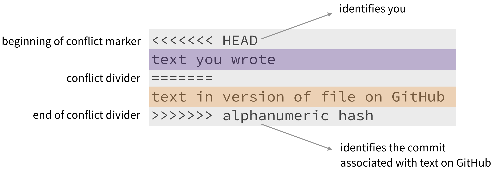

---
authors:
- admin
date: "2021-10-13"
projects: []
subtitle: ' '
title: 'Merge conflicts'
summary: " "  
menu:
  misc:
    weight: 2
---

### Merge conflicts

A **merge conflict** is a result of multiple people editing the same lines of the document simultaneously (or one person having edit the lines yesterday and another person not `pull`ing before editing the same lines). In such a case, `git` needs human help to decide which lines to keep and/or how to merge them. If this is happening to you, `git` will refuse to merge files smoothly and will ask you to intervene and do some extra steps. Dealing with merge conflicts is most often not too complicated, but it's better to prevent them from happening and/or to make them easier to resolve.

This how a merge conflict looks like in your files:

To **resolve the merge conflict**:

- open the file with merge conflict in Rstudio editor panel
- decide if you want to keep only your text or the text on GitHub or incorporate changes from both texts
- delete the conflict markers <<<<<<<, =======, >>>>>>> and make the changes you want in the final merge

For more info on merge conflicts, and if you need to consolidate a document please have a look [at this guide](https://happygitwithr.com/) in Particular [Section 28](https://happygitwithr.com/pull-tricky.html#git-pull-with-local-commits).

